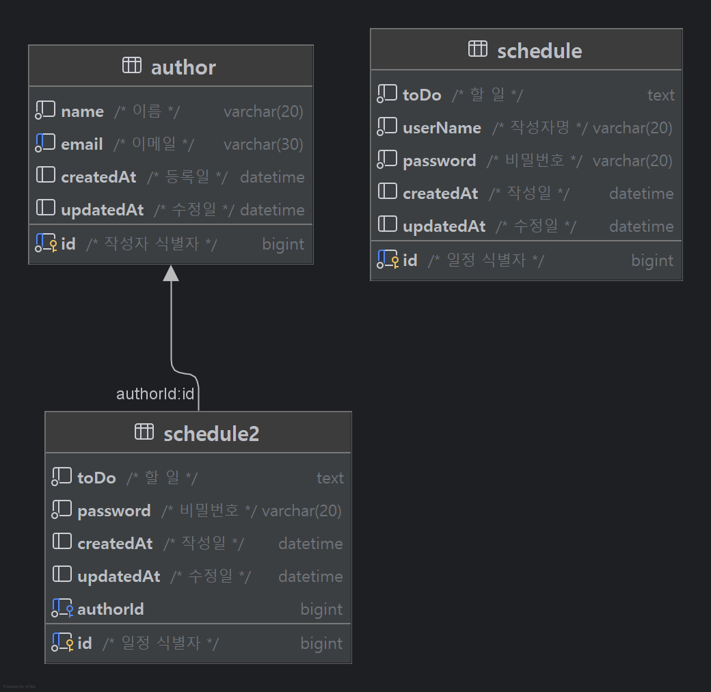

# 일정 관리 앱

이 프로젝트는 일정을 생성하고, 조회하고, 수정하고, 삭제할 수 있는(CRUD) **RESTful API** 기반 일정 관리 앱 입니다.  
작성자와 일정 간의 관계를 분리하여 작성자 고유 식별자(Id)를 통해 명확한 연관관계를 유지할 수 있도록 설계되었습니다.  

## 사용 기술
`Java`, `Spring`, `JdbcTemplate`, `MySQL`, `Postman` 등

## 요구 사항 및 기능 설명

### 1. 일정 생성
- 일정 생성 시 다음 정보를 포함
  - 할 일, 작성자명, 비밀번호, 작성/수정일
- 수정일은 최초 등록 시 작성일과 동일
- 일정 ID는 자동 생성됨
- 작성자는 고유 식별자(FK)를 통해 참조

### 2. 전체 일정 조회
- 다음 조건으로 조회
  1. `수정일 (YYYY-MM-DD)`
  2. `작성자명`
- 위 조건들을 모두 또는 하나만 적용하거나, 어느 것도 적용하지 않을 수 있음
- 결과는 `수정일` 기준으로 내림차순 정렬

### 3. 일정 단건 조회
- 일정의 고유 식별자(ID)를 사용하여 단건 조회 가능

### 4. 일정 수정
- 일정 ID로 선택한 일정의 내용을 수정
  - 할일
  - 작성자명
- 수정 요청 시 비밀번호가 일치하는지 확인
- 작성일은 변경 불가, 수정일은 수정한 시점으로 변경

### 5. 일정 삭제
- 일정 ID로 선택한 일정을 삭제
- 삭제 요청 시 비밀번호가 일치하는지 확인

### 6. 작성자 관리 및 일정 연결
- 동명이인의 작성자를 구별하기 위해 작성자 테이블을 추가
- 작성자는 다음 정보를 포함
  - 이름, 이메일, 등록일, 수정일
- 일정 테이블에 작성자의 고유식별자 ID(FK)를 연결
- 작성자 ID를 통해 특정 작성자의 일정들을 조회

## API 명세

| 기능              | Method | URL                             | 설명                             |
|-------------------|--------|----------------------------------|----------------------------------|
| 작성자 생성        | POST   | `/authors`                       | 이름 + 이메일 등록               |
| 일정 등록          | POST   | `/authors/{authorId}/schedules`  | 특정 작성자의 일정 등록          |
| 전체 일정 조회     | GET    | `/schedules`                     | 조건 필터링(작성자명, 수정일 등) |
| 단일 일정 조회     | GET    | `/schedules/{id}`                | 일정 ID로 단건 조회              |
| 일정 수정          | PATCH  | `/schedules/{id}`                | 할일/작성자명 수정 (비밀번호 필요) |
| 일정 삭제          | DELETE | `/schedules/{id}`                | 비밀번호 확인 후 삭제            |
| 작성자 일정 조회    | GET    | `/authors/{authorId}/schedules`  | 작성자 ID 기준 일정 목록 조회    |


### 1. 작성자 생성
- POST `/authors`
- Request `Body`
```json

{
    "name": "작성자3",
    "email": "asdww@dasdvc.com"
}
```
- Response
```json
{
    "id": 3,
    "name": "작성자3",
    "email": "asdww@dasdvc.com",
    "createdAt": "2025-05-14 10:51:25",
    "updatedAt": "2025-05-14 10:51:25"
}
```

### 2. 일정 등록
- POST `/authors/{authorId}/schedules`  
- Request `PathVariable: authorId`, `Body`
- `/authors/2/schedules`
- Body
```json
{
    "toDo": "일정ㅇㅇ6",
    "password": "비밀번호6"
}
```
- Response
```json
{
    "id": 6,
    "toDo": "일정ㅇㅇ6",
    "authorId": 2,
    "createdAt": "2025-05-14 10:55:54",
    "updatedAt": "2025-05-14 10:55:54"
}
```

### 3. 전체 또는 특정 조건 일정 조회
- GET `/schedules`  
- Request `query parameter(required = false)`
  - userName(Lv3에서는 삭제)
  - updatedAt
- `/schedules?updatedAt=2025-05-14`
- Response
```json
[
    {
        "id": 2,
        "toDo": "id2의 일정을 수정",
        "authorId": 1,
        "createdAt": "2025-05-14 10:54:50",
        "updatedAt": "2025-05-14 10:58:17"
    },
    {
        "id": 6,
        "toDo": "일정ㅇㅇ6",
        "authorId": 2,
        "createdAt": "2025-05-14 10:55:54",
        "updatedAt": "2025-05-14 10:55:54"
    },
    {
        "id": 5,
        "toDo": "일정ㅇㅇ5",
        "authorId": 2,
        "createdAt": "2025-05-14 10:55:48",
        "updatedAt": "2025-05-14 10:55:48"
    },
    {
        "id": 4,
        "toDo": "일정ㅇㅇ4",
        "authorId": 1,
        "createdAt": "2025-05-14 10:55:31",
        "updatedAt": "2025-05-14 10:55:31"
    },
    {
        "id": 3,
        "toDo": "일정ㅇㅇ3",
        "authorId": 1,
        "createdAt": "2025-05-14 10:55:11",
        "updatedAt": "2025-05-14 10:55:11"
    }
]
```

### 4. 단일 일정 조회
- GET `/schedules/{id}`
- Request `PathVariable: id`
- `/schedules/6`
- Response
```json
{
    "id": 6,
    "toDo": "일정ㅇㅇ6",
    "authorId": 2,
    "createdAt": "2025-05-14 10:55:54",
    "updatedAt": "2025-05-14 10:55:54"
}
```

### 5. 일정 수정
- PATCH `/schedules/{id}`  
- Request `PathVariable: id`, `Body`
- `/schedules/2`
- Body
```json
{
    "toDo": "id2의 일정을 수정",
    "password": "비밀번호3"
}
```

### 6. 일정 삭제
- DELETE `/schedules/{id}`
- Request `PathVariable: id`, `Body`
- `/schedules/2`
- Body
```json
{
    "password": "비밀번호3"
}
```

### 7. 작성자의 일정 조회
- GET `/authors/{authorId}/schedules` 
- Request `PathVariable: authorId`
- `/authors/1/schedules`
- Response
```json
[
    {
        "id": 2,
        "toDo": "id2의 일정을 수정",
        "authorId": 1,
        "createdAt": "2025-05-14 10:54:50",
        "updatedAt": "2025-05-14 10:58:17"
    },
    {
        "id": 4,
        "toDo": "일정ㅇㅇ4",
        "authorId": 1,
        "createdAt": "2025-05-14 10:55:31",
        "updatedAt": "2025-05-14 10:55:31"
    },
    {
        "id": 3,
        "toDo": "일정ㅇㅇ3",
        "authorId": 1,
        "createdAt": "2025-05-14 10:55:11",
        "updatedAt": "2025-05-14 10:55:11"
    }
]
```


## ERD



## 파일 디렉토리 구조
```
📦src/main/java/com.example.springscheduleapi
 ┣ 📂Lv12
 ┃ ┣ 📂controller
 ┃ ┃ ┗ 📜ScheduleController.java
 ┃ ┣ 📂dto
 ┃ ┃ ┣ 📜PasswordCheckRequestDto.java
 ┃ ┃ ┣ 📜ScheduleRequestDto.java
 ┃ ┃ ┗ 📜ScheduleResponseDto.java
 ┃ ┣ 📂entity
 ┃ ┃ ┗ 📜Schedule.java
 ┃ ┣ 📂repository
 ┃ ┃ ┣ 📜JdbcTemplateScheduleRepository.java
 ┃ ┃ ┗ 📜ScheduleRepository.java
 ┃ ┗ 📂service
 ┃ ┃ ┣ 📜ScheduleService.java
 ┃ ┃ ┗ 📜ScheduleServiceImpl.java
 ┃ ┃
 ┣ 📂Lv3
 ┃ ┣ 📂controller
 ┃ ┃ ┣ 📜AuthorScheduleController.java
 ┃ ┃ ┗ 📜ScheduleController.java
 ┃ ┣ 📂dto
 ┃ ┃ ┣ 📜AuthorRequestDto.java
 ┃ ┃ ┣ 📜AuthorResponseDto.java
 ┃ ┃ ┣ 📜PasswordCheckRequestDto.java
 ┃ ┃ ┣ 📜ScheduleRequestDto.java
 ┃ ┃ ┗ 📜ScheduleResponseDto.java
 ┃ ┣ 📂entity
 ┃ ┃ ┣ 📜Author.java
 ┃ ┃ ┗ 📜Schedule.java
 ┃ ┣ 📂repository
 ┃ ┃ ┣ 📜AuthorRepository.java
 ┃ ┃ ┣ 📜JdbcTemplateAuthorRepository.java
 ┃ ┃ ┣ 📜JdbcTemplateScheduleRepository.java
 ┃ ┃ ┗ 📜ScheduleRepository.java
 ┃ ┗ 📂service
 ┃ ┃ ┣ 📜AuthorService.java
 ┃ ┃ ┣ 📜AuthorServiceImpl.java
 ┃ ┃ ┣ 📜ScheduleService.java
 ┃ ┃ ┗ 📜ScheduleServiceImpl.java
 ┗ 📜SpringScheduleApiApplication.java
```

## 트러블슈팅
https://github.com/kcc5107/TIL/blob/main/2025-05-13.md  
